# 遊んで学んで-デジタルコンテンツの裏側を見てみよう
---
## まずは遊んで見よう！

準備する事
1. micro:bitをPCをUSBケーブルで繋ぐ
2. micro:bitに「プログラムファイル」を入れる
3. gameを開始する。
---
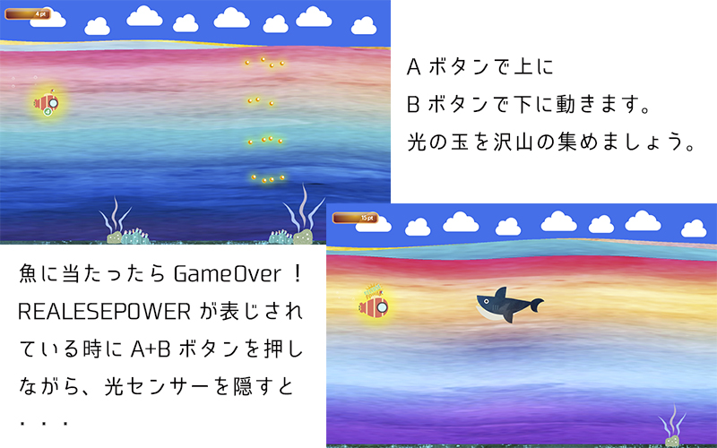
---
早速　Micro:bitをでプログラムをして見よう！

[Micro:bit]("http://microbit.org/")

---
### <ruby>Tutorial<rp>（</rp><rt>チュートリアル</rt><rp>）</rp></ruby>(まずはじめに使い方の説明)

##### [http://microbit.org/](http://microbit.org/)
---

---
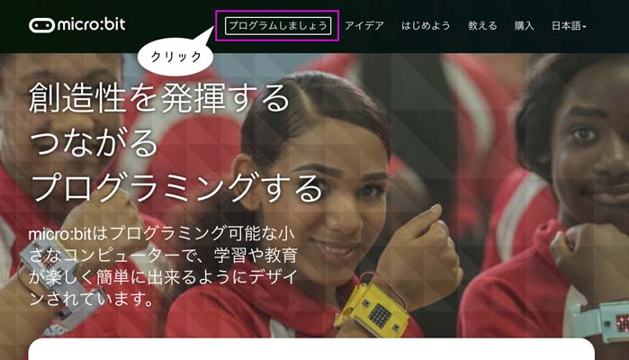
---
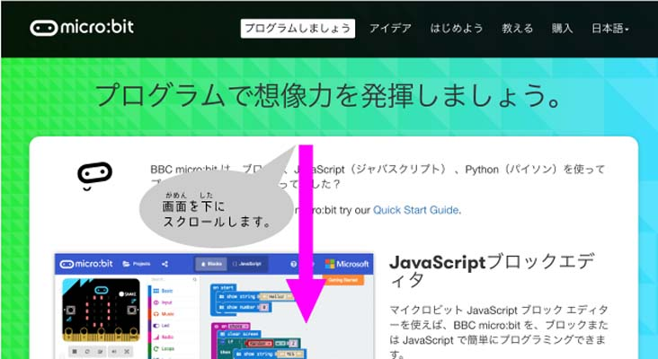
---
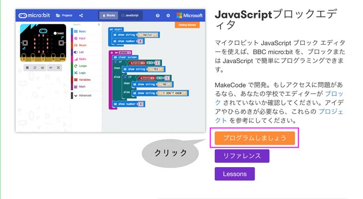
---
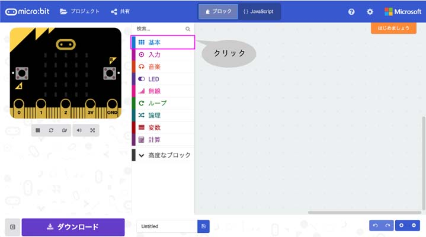
##### 「<ruby>基本<rp>（</rp><rt>きほん</rt><rp>）</rp></ruby>」をクリックしましょう。
---
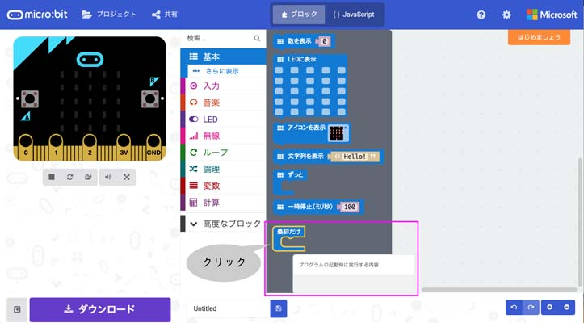
##### 「<ruby>最初<rp>（</rp><rt>さいしょ</rt><rp>）</rp></ruby>だけ」をクリックしましょう。
---
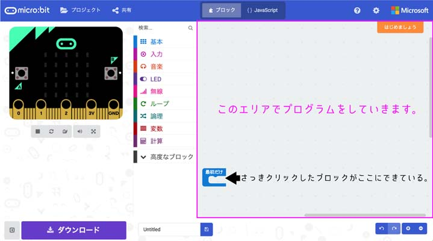
##### 次に、また「<ruby>基本<rp>（</rp><rt>きほん</rt><rp>）</rp></ruby>」をクリックしましょう。
---
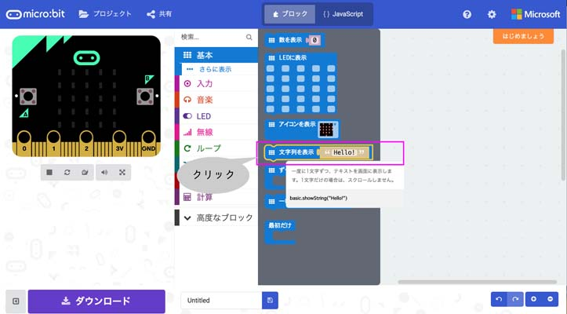
##### 「<ruby>文字列<rp>（</rp><rt>もじれつ</rt><rp>）</rp></ruby>を<ruby>表示<rp>（</rp><rt>ひょうじ</rt><rp>）</rp></ruby>」をクリックしましょう。
---
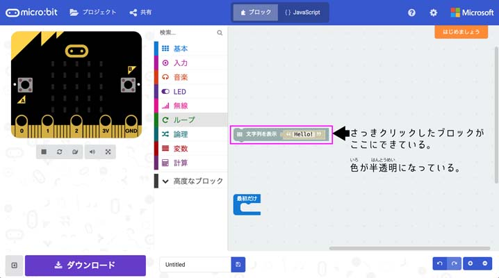
##### 「<ruby>文字列<rp>（</rp><rt>もじれつ</rt><rp>）</rp></ruby>を<ruby>表示<rp>（</rp><rt>ひょうじ</rt><rp>）</rp></ruby>」をドラッグして「<ruby>最初<rp>（</rp><rt>さいしょ</rt><rp>）</rp></ruby>だけ」の中に入れよう。
---
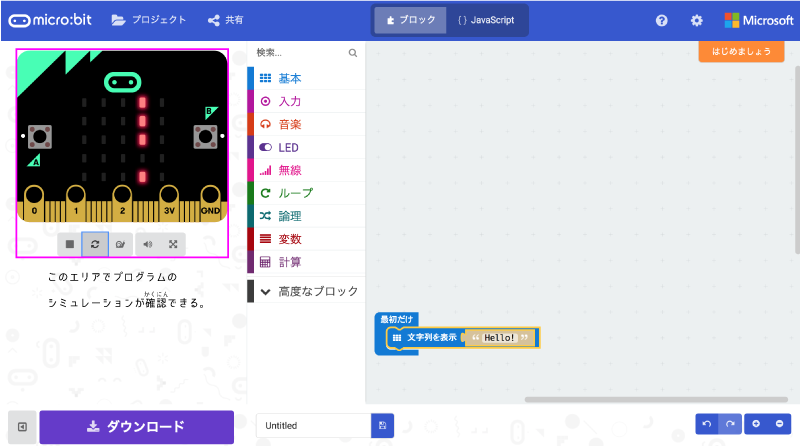
##### 一回だけ「Hello!」という文字が表示されることを左のシミュレーターで<ruby>確認<rp>（</rp><rt>かくにん</rt><rp>）</rp></ruby>しよう。
---
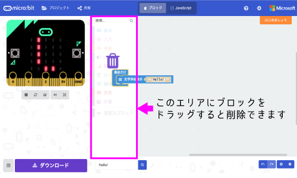
##### 左のエリアにドラッグしてブロックを削除しよう。

---
### <ruby>LESSON<rp>（</rp><rt>レッスン</rt><rp>）</rp></ruby>
#### <ruby>操作方法<rp>（</rp><rt>そうさほうほう</rt><rp>）</rp></ruby>は<ruby>理解<rp>（</rp><rt>りかい</rt><rp>）</rp></ruby>しましたか？
理解ができたところで、実際にmicrobitを自分の思い通りに
動かせるようにプログラムを組んでいきましょう！

---
#### ハードウェアの<ruby>紹介<rp>（</rp><rt>しょうかい</rt><rp>）</rp></ruby>：<ruby>micro:bit<rp>（</rp><rt>マイクロビット</rt><rp>）</rp></ruby>

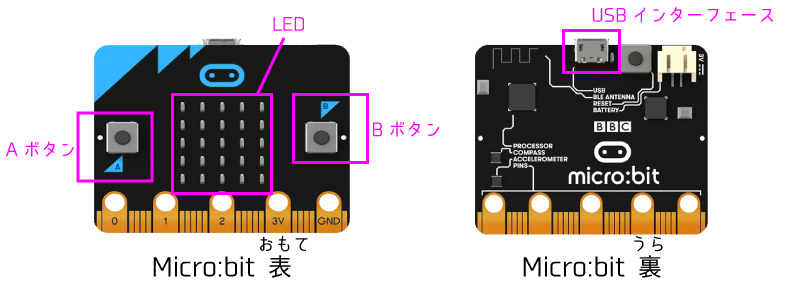
##### マイクロコンピュータと<ruby>入力<rp>（</rp><rt>にゅうりょく</rt><rp>）</rp></ruby>や<ruby>出力<rp>（</rp><rt>しゅつりょく</rt><rp>）</rp></ruby>を<ruby>備<rp>（</rp><rt>そな</rt><rp>）</rp></ruby>えた<ruby>基盤<rp>（</rp><rt>きばん</rt><rp>）</rp></ruby>です。
---
#### <ruby>取扱<rp>（</rp><rt>とりあつか</rt><rp>）</rp></ruby>いの<ruby>注意点<rp>（</rp><rt>ちゅういてん</rt><rp>）</rp></ruby>！ 濡れた手でさわらない

---
#### <ruby>micro:bit<rp>（</rp><rt>マイクロビット</rt><rp>）</rp></ruby>の<ruby>機能紹介<rp>（</rp><rt>きのうしょうかい</rt><rp>）</rp></ruby>⑴ LED
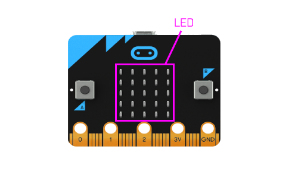
#####  <ruby>LED<rp>（</rp><rt>エル イー ディー</rt><rp>）</rp></ruby>:は<ruby>発行<rp>（</rp><rt>はっこう</rt><rp>）</rp></ruby>ダイオード(Light Emitting Diode)という意味です。Micro:bitには25個のLEDがあり、これを使って数字や文字を表現してます。
---
### LESSON1「出力」
---
### LESSON1 の目的

- LEDの表示を自分の意図した通りに表現する。
- 「最初だけ」「ずっと」「ミリ秒」を理解する。
- プログラムをmicro:bitに入れて動かす。

---
#### Micro:bitのLEDを制御して色々な表示をしよう
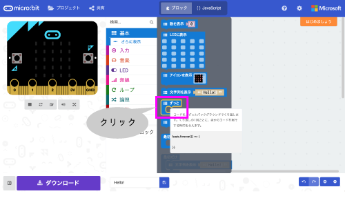
##### 「基本」→「ずっと」を<ruby>選<rp>（</rp><rt>えら</rt><rp>）</rp></ruby>んでクリックします。
---
#### アイコンを表示しよう

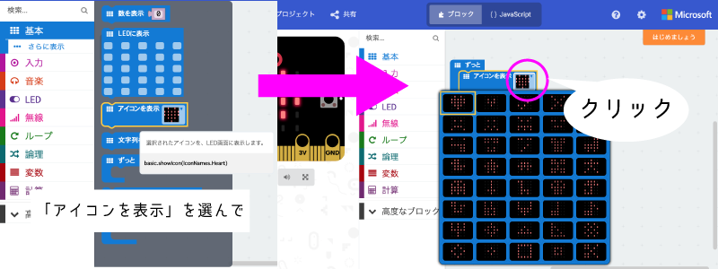

##### 「アイコンを表示」を選んで「ずっと」ブロックの中に入れ、アイコンをクリックして好きなアイコンを表示するプログラムを作りましょう。
---
### プログラムとは

プログラムは、コンピュータを動かす為に「いつ」「どうする」を書いた命令書みたいなものだよ。

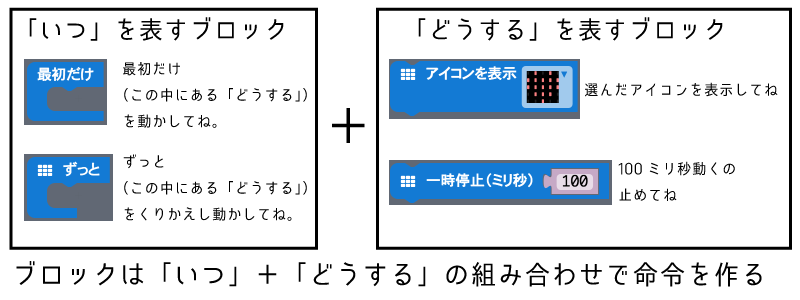
---
### やってみよう!
#### ハートがドキドキするアニメーションを作ってみよう！

<iframe style="display: block; margin: 0px auto;position:absolute;top:0;left:0;width:60%;height:60%;" src="https://makecode.microbit.org/---run?id=_E862qX8ACXFf" allowfullscreen="allowfullscreen" sandbox="allow-popups allow-forms allow-scripts allow-same-origin" frameborder="1"></iframe>

---
### ヒント

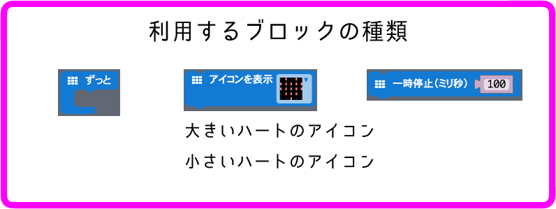

---
### プログラムに名前をつけよう。
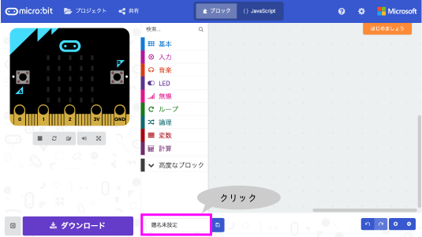
- 「クリック」
- 「delete」キーで「題名未設定」を削除
- 「Heart」と入力します。
---
### プログラムを保存しよう。
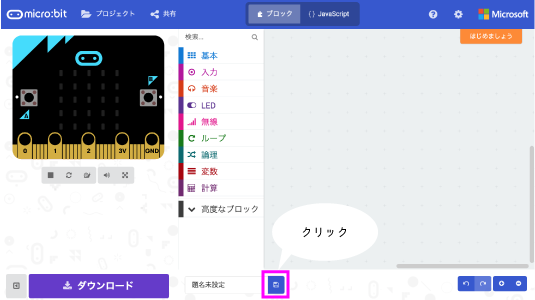
- 上をクリックするとプログラムファイルがダウンロードフォルダに保存される。
---
### プログラムをMicro:bitに入れて動かして見よう！
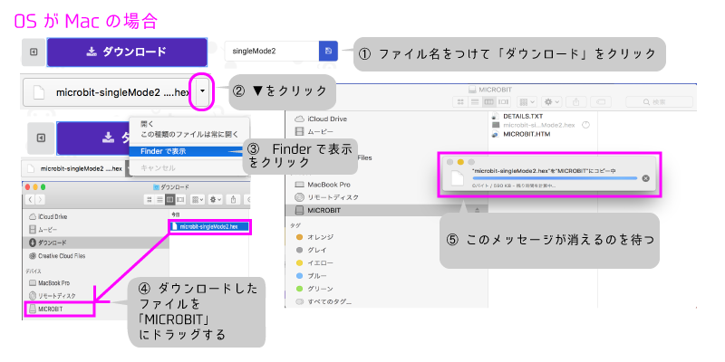

---

---
### LESSON2 [入力]
Micro:bitのLEDに色々な表示ができるようになりましたか？
LESSON1では、Micro:bitの出力を変更する事をやりました。 
それでは、続いてMicro:bitの「入力」を使って「出力」する物を変える事をやって見ましょう。

---
### LESSON2 の目的

- 入力条件について理解する
- 変数の使い方が分かる
---

### ボタンを使って、表示する数値を変えてみよう。
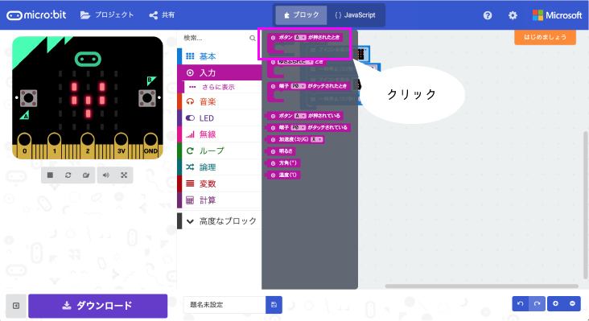
---
### Aボタンを押すと「0を表示する」を作る

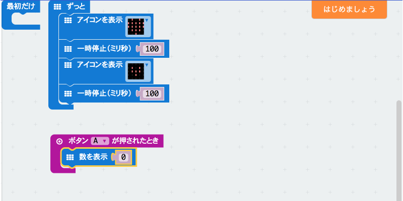

---
### 変数を使ってみよう[変数]をクリック
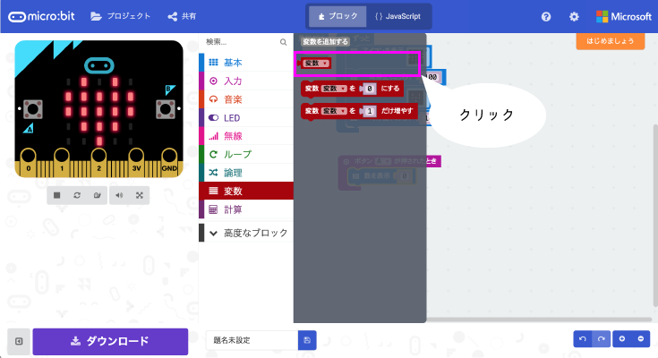

---
### 「変数を０にする」をクリック
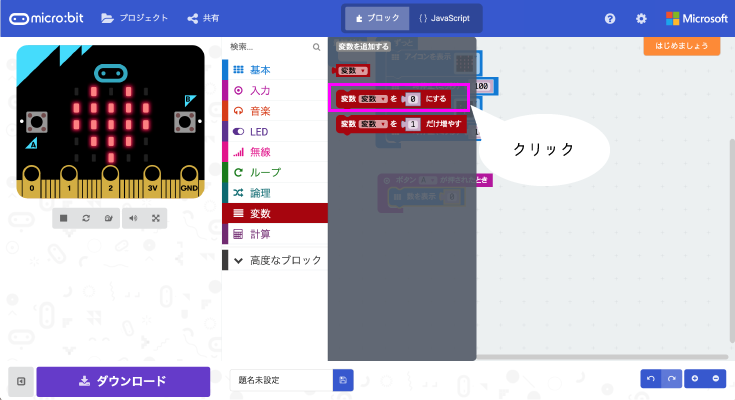

---
### 「変数」を使って数字を表示しよう
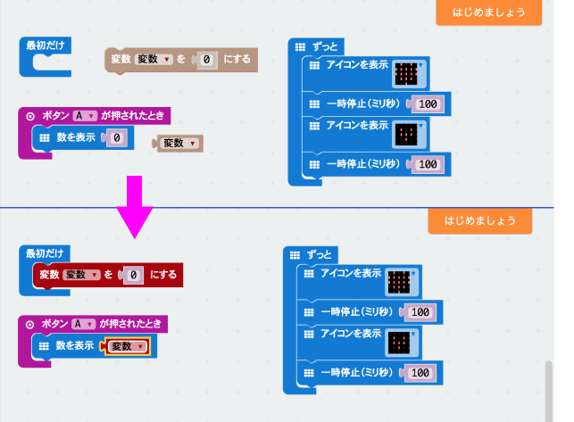

---
### Aボタンを押して「０」が表示された
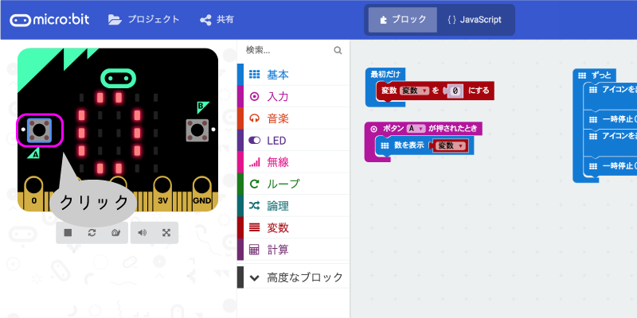
---
### 変数のイメージ
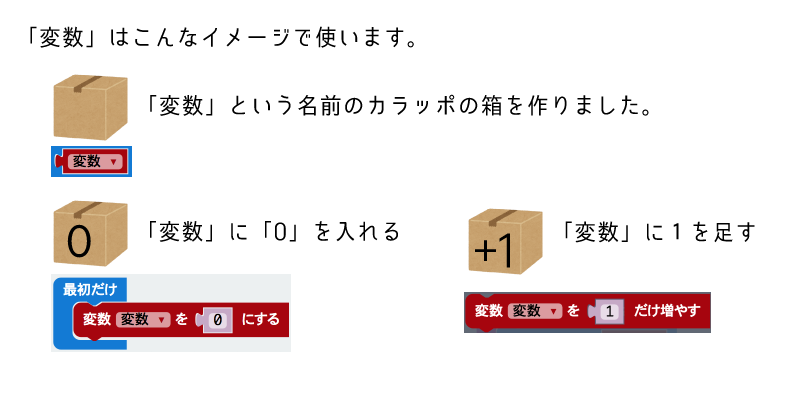

---
### Bボタンを押して表示する数字を増やそう

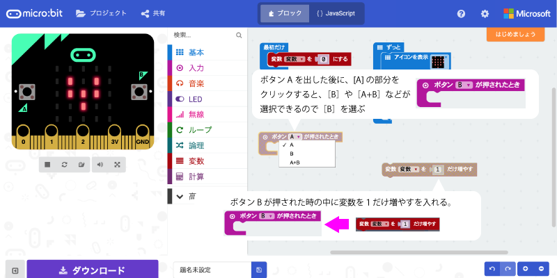

---
### LESSON3 [制御]
それでは、いよいよ、プログラムの制御について学びます。

実際に体験したゲームコントローラーのプログラムを
改造しながら、学んで行きましょう。

---
