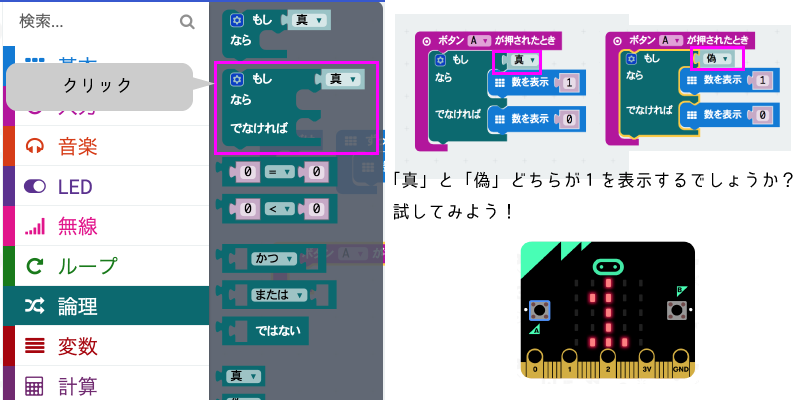

# 遊んで学んで-デジタルコンテンツの裏側を見てみよう
---
## まずは遊んで見よう！

準備する事
1. プログラムの準備「ゲームファイルをダウンロード」
2. コントローラの準備１「micro:bitとPCをUSBケーブルで繋ぐ」
3. コントローラの準備2 「micro:bitにプログラムを入れる」
4. Gameの開始 「Gameファイルをクリックする」
---
### プログラムの準備
ファイルのダウンロードお使いのPCのOSに合わせてダウンロードしてください。下にある「ダウンロード」をWindowsかMacを選んでクリック

Windows版:[ダウンロード](https://github.com/TheDesignium/playful-learning/blob/master/windows.zip?raw=true) 
Mac版:[ダウンロード](https://github.com/TheDesignium/playful-learning/blob/master/osx.zip?raw=true)

---
### コントローラの準備１[Microbitの準備]

---
### コントローラの準備2
Microbitにプログラムを入れる「動画説明」

<iframe width="560" height="315" src="https://www.youtube.com/embed/eS0ZpXzmQ0c?rel=0&amp;showinfo=0" frameborder="0" allow="autoplay; encrypted-media" allowfullscreen></iframe>
---
### コントローラの準備2
Microbitにプログラムを入れる

---
### Gameの開始
ファイルの場所(画面はMac版)

---
セキュリティメッセージが出た場合の回避方法(Mac版)

---
Game画面スタート(Mac版)

---

---
早速　Micro:bitをでプログラムをして見よう！

[Micro:bit]("http://microbit.org/")

---

### プログラムに名前をつけよう。

- 「クリック」
- 「delete」キーで「題名未設定」を削除
- 「Heart」と入力します。
---
### プログラムを保存しよう。

- 上をクリックするとプログラムファイルがダウンロードフォルダに保存される。
---
#### プログラムをMicro:bitに入れてみよう！Mac版

---
#### プログラムをMicro:bitに入れてみよう！Windows版

---
### LESSON3 [制御]
それでは、いよいよ、プログラムの制御について学びます。

実際に体験したゲームコントローラーのプログラムを
改造しながら、学んで行きましょう。

---
### LESSON3 の目的
- 条件分岐を理解する
- 複数の変数を利用する

---
### プログラムの読み込み

---
### プログラムを選択する

---
###  ボタンの機能を変更しよう

---
### A+Bボタンの中を見てみよう

[lightVal]という変数に「明るさ」の中の数値を入れている。

---
### 明るさの数値を表示してみよう。

---
### 明るさを数字表示に入れてみよう

---
### 明るさの数値を確認

---
### 「明るさ」の仕組み

---
### <ruby>条件分岐<rp>（</rp><rt>じょうけんぶんき</rt><rp>）</rp></ruby>

---
### もっと詳しく条件分岐を知ろう

---
### 変数を使った条件分岐

---
### 変数を操る

---
### 変数と条件分岐の活用

---
### 再び、コントローラーのプロジェクトを開こう

---
### A+Bボタンのプログラムを確認しよう

---
### A+Bボタンの条件分岐を見てみよう

---
### 使いやすいコントローラーにしよう
[A+B]を押しながら光センサーを隠すとプレイヤーが消える。 
しかし、このままだと、使いづらい！もっと簡単にしよう！ 

---
### やってみよう！

A+Bボタンをおすと、LEDの画面に1と表示されて、 
もう一度押すと0と表示される。 
1と表示されている間は、プレイヤーが消えて、 
0と表示されている間はプレイヤーが表示されるように改造してみよう。 
flagという変数を作ってやってみよう！

---
### ヒント

---
### さぁ、他にも改造してオリジナルのコントローラーを作ろう！
